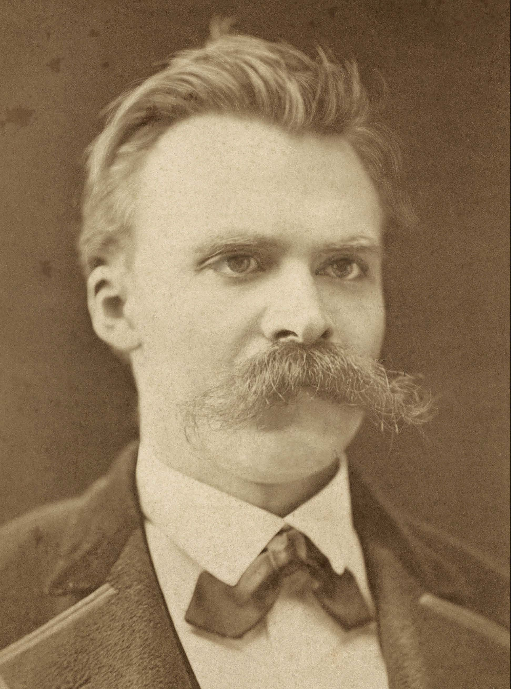

---
# YAML metadata
title: "The labyrinth of Nietzsche's illness"
author: "Matthew Brett"
linkcolor: blue
urlcolor: blue
bibliography: nietzsche.bib
---

# The Labyrinth

{height=80%}

[@volz1990nietzsche]]
# Journey

* Born 1844
* 1869: Professor of philogy at Basel (age 24).
* From 1871 — increasingly frequent, debilitating attacks of headaches,
  vomiting and eye pain.
* 1872: "Birth of Tragegy".
* 1878/79: "Human all too human".
* 1883-85: "Thus Spoke Zarathustra".
* 1888: signs of mania.
* Jan 1889: collapse in Turin, admitted to Basel asylum.  Diagnosed as
  "progressive paralysis".
* 1889-1890: progressive decline.
* 24 August 1890: death from stroke, pneumonia.

# From this (1875)

{height=80%}

# To this (1889)

{width=80%}

# Why is this interesting?

* Terrible confusion and controversy about diagnosis.
* Writers with humanities backgrounds tend to assume much of N's illness was
  psychosomatic.
* Hero or fool?

# Confusion

* Progressive paralysis (syphilis), initial diagnosis by admitting physician
  in Basel, reasserted by Otto Binswanger in Jena, and later [@volz1990nietzsche].
* "manic-depressive illness, probably followed by multi-infarct dementia"
  [@cybulska2000madness].
* Menigioma [@sax2003meningioma].
* Fronto-temporal dementia [@orth2006nietzsche_ftd].
* Cerebral autosomal dominant arteriopathy with subcortical infarcts and
  leukoencephalopathy (CADASIL) [@hemelsoet2008neurological].
* Mitochondrial encephalomyopathy (MELAS) [@koszka2009melas].

# Assertions 1: "almost certainly"

> This article examines how Nietzsche’s illness bears on his philosophical ideas. It demonstrates that the long-standard explanation for Nietzsche’s dementia—syphilis—is almost certainly false. The cause is much more likely to have been a brain tumor, which had caused him severe headaches and eye problems since childhood. [@huenemann2013nietzsches_illness].

# Assertions 2: no-one will ever know.

> I have avoided any retrospective diagnosis, the curse of Nietzsche
scholarship ever since Nietzsche’s death. Here, as elsewhere, we can only rely
on the observations and comments of his contemporaries as to what "disease"
was from which he suffered. The contradictions and quarrels tell us more about
those making the diagnosis than about Nietzsche’s actual illness or illnesses.
— [@gilman2009eiser].

# Assertions 3: the nervous Nietzsche

> These fits of nausea and vomiting were almost certainly psychosomatic
symptoms of nervous anxiety over his friends' reactions to his new book.
[@cate2005friedrich].

# Some key facts — father

July 1849: father dies age 36 of a progressive neurological illness, of duration at least many months.

> „Sein Kopf ist geöffnet worden, und es hat sich bestätigt, daß er an
Hirnerweichung gestorben ist, welche schon ein vierthel seines Kopfes
eingenommen hatte." (GSA 100/446) [@goch2000nietzsches_vater, p385].

# Early illness

* August 1856 : "schlechten Augen",  (letter to FZN).
* 1858–1864 : Schulpforta, Naumburg.  Frequent sickness requiring time off
  school, headaches, rheumatism.
* Attacks accelerate markedly in 1872, reach extremes of 118 sick days in
  1879, start to subside in 1892.

# An attack — 1875

> Ich habe eine sehr schlimme Zeit hinter mir und vielleicht eine noch
schlimmere vor mir. Der Magen war gar nicht mehr zu bändigen, auch bei der
lächerlich strengsten Diät, mehrtägige Kopfschmerzen der heftigsten Art, in
wenig Tagen wieder kommend, stundenlanges Erbrechen, ohne etwas gegessen zu
haben, kurz, die Maschine schien in Stücke gehen zu wollen und ich will nicht
leugnen, einige Male gewünscht zu haben, sie wäre es. Grosse Abmattung,
mühsames Gehen auf der Strasse, starke Empfindlichkeit gegen Licht; Immermann
kurirte auf so etwas wie ein Magengeschwür, und ich erwartete immer
Bluterbrechen. Ich musste 14 Tage lang Höllenstein-Auflösung einnehmen, es
half nichts. Jetzt giebt er mir täglich zweimal ausserordentlich grosse Dosen
von Chinin. --- Brief AN Carl von Gersdorff: um 26. Juni 1875.

# Opthalmoscope

> Der Augenspiegel zeigt in beiden Augen die Produkte einer Chorioretinitis
centralis, im rechten Auge erheblich stärker als im linken. — Dr Otto Eiser,
[@volz1990nietzsche].

# Eyes

{height=80%}

# The diagnostic problem

Explicanda:

* Father's illness
* Early eye pain and headaches (from age <= 11)
* Very severe and very frequent headaches (from 1872).
* Chorioretinitis
* Mania and progressive dementia.

Some diagnoses seem much more likely than others.  How should we persuade our
academic colleagues of this?  Bayesian / likelihood reasoning?

# Suggestions

Time for the audience.

# The end

Materials at <https://github.com/nietzsches-illness/nietzsche-agms>.

<#ifdef HANDOUT>
# References
<#endif>
