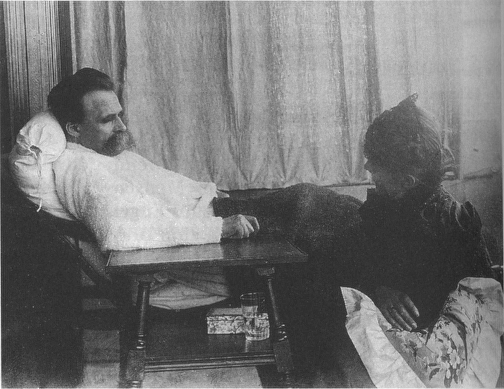

---
# YAML metadata
title: "Im Labyrinth von Nietzsches Krankheit"
author: "Matthew Brett"
linkcolor: blue
urlcolor: blue
bibliography: nietzsche.bib
---

# Im Labyrinth

{height=80%}

[@volz1990nietzsche]]

# Die Reise

* Geboren 1844
* 1869: Professor der Philogie in Basel (24 Jahre alt).
* Ab 1871 - immer häufiger auftretende, lähmende Anfälle von Kopfschmerzen,
  Erbrechen und Augenschmerzen.
* 1872: „Geburt der Tragödie“.
* 1878/79: „Menschliches, Allzumenschliches".
* 1883-85: „Also sprach Zarathustra“.
* 1888: Anzeichen von Manie.
* Januar 1889: Zusammenbruch in Turin, Einweisung in die Heilanstalt Basel.
  Diagnostiziert als „progressive Paralyse".
* 1889-1890: fortschreitender Verfall.
* 24 August 1890: Tod durch Schlaganfall und Lungenentzündung.

<!---
# Journey

* Born 1844
* 1869: Professor of philogy at Basel (age 24).
* From 1871 — increasingly frequent, debilitating attacks of headaches,
  vomiting and eye pain.
* 1872: "Birth of Tragegy".
* 1878/79: "Human all too human".
* 1883-85: "Thus Spoke Zarathustra".
* 1888: signs of mania.
* Jan 1889: collapse in Turin, admitted to Basel asylum.  Diagnosed as
  "progressive paralysis".
* 1889-1890: progressive decline.
* 24 August 1890: death from stroke, pneumonia.
-->

# von diesem (1875)

{height=80%}

# zu diesem (1889)

{width=80%}

# Warum ist das interessant?

* Schreckliche Verwirrung und Kontroverse über die Diagnose.
* Schriftsteller mit geisteswissenschaftlichem Hintergrund neigen zu der
  Annahme, dass ein Großteil von Ns Krankheit psychosomatisch war.
* Held oder Narr?

# Confusion

* Progressive Paralyse (Syphilis), Erstdiagnose des einweisenden Arztes in
  Basel in Basel, bestätigt durch Otto Binswanger in Jena, und später
  [@volz1990nietzsche].
* Manisch-depressive Erkrankung, wahrscheinlich gefolgt von einer
  Multi-Infarkt-Demenz [@cybulska2000madness].
* Menigiom [@sax2003meningioma].
* Fronto-temporale Demenz [@orth2006nietzsche_ftd].
* Cerebral autosomal dominant arteriopathy with subcortical infarcts and
  leukoencephalopathy (CADASIL) [@hemelsoet2008neurological].
* Mitochondrial encephalomyopathy (MELAS) [@koszka2009melas].

# Behauptungen 1: "almost certainly"

> This article examines how Nietzsche’s illness bears on his philosophical
ideas. It demonstrates that the long-standard explanation for Nietzsche’s
dementia—syphilis—is almost certainly false. The cause is much more likely to
have been a brain tumor, which had caused him severe headaches and eye problems
since childhood. [@huenemann2013nietzsches_illness].

# Behauptungen 2: niemand wird es je erfahren

> I have avoided any retrospective diagnosis, the curse of Nietzsche
scholarship ever since Nietzsche’s death. Here, as elsewhere, we can only rely
on the observations and comments of his contemporaries as to what "disease" was
from which he suffered. The contradictions and quarrels tell us more about
those making the diagnosis than about Nietzsche’s actual illness or illnesses.
— [@gilman2009eiser].

# Behauptungen 3: der nervöse Nietzsche

> These fits of nausea and vomiting were almost certainly psychosomatic
symptoms of nervous anxiety over his friends' reactions to his new book.
[@cate2005friedrich].

# Einige wichtige Fakten - Vater

Juli 1849: Der Vater stirbt im Alter von 36 Jahren an einer fortschreitenden
neurologischen Krankheit, die mindestens mehrere Monate andauert.

> „Sein Kopf ist geöffnet worden, und es hat sich bestätigt, daß er an
Hirnerweichung gestorben ist, welche schon ein vierthel seines Kopfes
eingenommen hatte." (GSA 100/446) [@goch2000nietzsches_vater, p385].

# Frühe Krankheit

* August 1856 : „schlechte Augen“, (Brief an FZN).
* 1858-1864 : Schulpforta, Naumburg. Häufige Krankheiten, die eine Beurlaubung
  von der Schule, Kopfschmerzen, Rheumatismus.
* Die Anfälle nehmen 1872 deutlich zu, erreichen mit 118 Krankheitstagen 1879
  einen Höchststand. 1879, beginnen 1892 abzuflauen.

# Ein Anfall — 1875

> Ich habe eine sehr schlimme Zeit hinter mir und vielleicht eine noch
schlimmere vor mir. Der Magen war gar nicht mehr zu bändigen, auch bei der
lächerlich strengsten Diät, mehrtägige Kopfschmerzen der heftigsten Art, in
wenig Tagen wieder kommend, stundenlanges Erbrechen, ohne etwas gegessen zu
haben, kurz, die Maschine schien in Stücke gehen zu wollen und ich will nicht
leugnen, einige Male gewünscht zu haben, sie wäre es. Grosse Abmattung,
mühsames Gehen auf der Strasse, starke Empfindlichkeit gegen Licht; Immermann
kurirte auf so etwas wie ein Magengeschwür, und ich erwartete immer
Bluterbrechen. Ich musste 14 Tage lang Höllenstein-Auflösung einnehmen, es
half nichts. Jetzt giebt er mir täglich zweimal ausserordentlich grosse Dosen
von Chinin. --- Brief AN Carl von Gersdorff: um 26. Juni 1875.

# Ophthamoskopie

> Der Augenspiegel zeigt in beiden Augen die Produkte einer Chorioretinitis
centralis, im rechten Auge erheblich stärker als im linken. — Dr Otto Eiser,
[@volz1990nietzsche].

# Die Augen

{height=80%}

# Das diagnostische Problem

Explicanda:

* Krankheit des Vaters
* Frühe Augenschmerzen und Kopfschmerzen (ab Alter <= 11)
* Sehr starke und sehr häufige Kopfschmerzen (ab 1872).
* Chorioretinitis
* Manie und fortschreitende Demenz.

Einige Diagnosen scheinen viel wahrscheinlicher als andere. Wie sollten wir
unsere akademischen Kollegen davon überzeugen? Bayes'sche
Statistik/Wahrscheinlichkeitsrechnung?

# Vorschläge

Ihre Meinung.

# Das Ende

Materialien unter <https://github.com/nietzsches-illness/nietzsche-agms>.

<#ifdef HANDOUT>
# Quellenangaben
<#endif>
